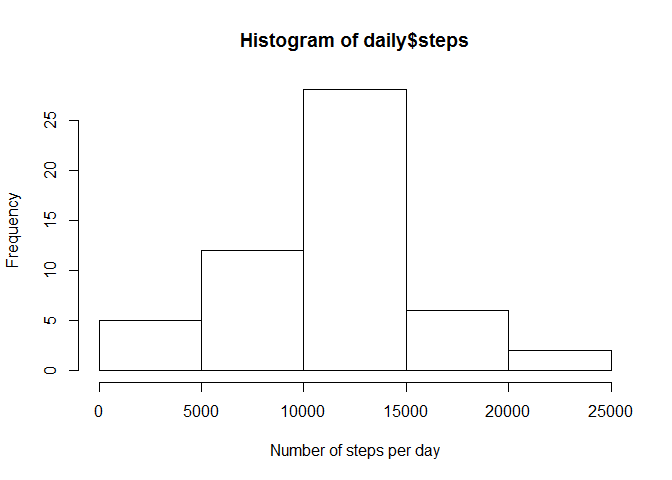
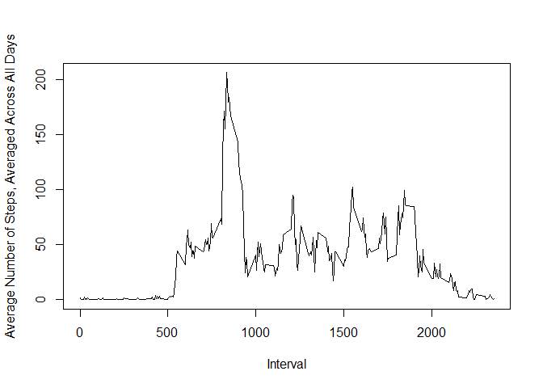
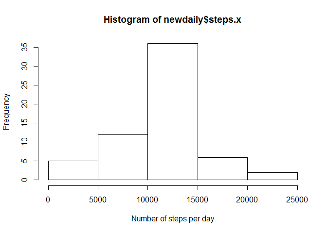
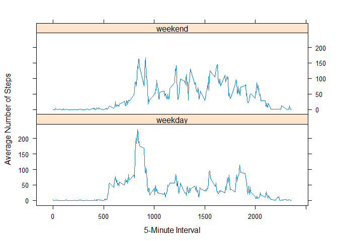

# Reproducible Research: Peer Assessment 1


## Loading and preprocessing the data

```r
### load the data
activity <- read.csv("activity.csv")

### split the data without NA
activity_wo_na <- activity[complete.cases(activity),]
```

## What is mean total number of steps taken per day?

```r
### number of steps per day
daily <- aggregate(steps ~ date, activity_wo_na, sum)
```


```r
### histgram
hist(daily$steps,
xlab="Number of steps per day"
)
```

\

### calculate and report the mean and median

```r
mean(daily$steps)
```

```
## [1] 10766.19
```

```r
median(daily$steps)
```

```
## [1] 10765
```

## What is the average daily activity pattern?

```r
### time series plot: 5-minute interval and the average number of steps, averaged across all days
interval <- aggregate(steps ~ interval, activity_wo_na, mean)

plot(x = interval$interval,
     y = interval$steps,
     type = "l",
     xlab = "Interval",
     ylab = "Average Number of Steps, Averaged Across All Days"
)
```

\

### Which 5-minute interval contains the maximum number of steps?

```r
interval[interval$steps==max(interval$steps),]
```

```
##     interval    steps
## 104      835 206.1698
```

## Imputing missing values

```r
### Calculate the total number of missing values
nrow(activity[is.na(activity$steps),])
```

```
## [1] 2304
```

```r
### devise a strategy for filling the missing values
# mean for the 5-minutes interval is used for filling missing values

### create a new dataset with the missing values filled in
activity_no_na <- merge(activity, interval, by = 'interval', all.y = F)

activity_no_na$steps.x[is.na(activity_no_na$steps.x)] <- as.integer(round(activity_no_na$steps.y[is.na(activity_no_na$steps.x)]))
```

### make a histogram and calculate the mean and median total number steps per day

```r
newdaily <- aggregate(steps.x ~ date, activity_no_na, sum)

hist(newdaily$steps.x,
xlab="Number of steps per day"
)
```

\

```r
mean(newdaily$steps)
```

```
## [1] 10765.64
```

```r
median(newdaily$steps)
```

```
## [1] 10762
```


```r
### do these values differ from the estimates from the first part of the assignment?

# Difference is so minor.

### what is the impact of imputing missing data on the estimates of the total daily number of steps?

# By using the average, the difference is minimized.
```

## Are there differences in activity patterns between weekdays and weekends?

```r
### create a new factor variable

newactivity <- activity_no_na

weekend <- weekdays(as.Date(newactivity$date)) %in% c("土曜日","日曜日")

newactivity$daytype <- "weekday"

newactivity$daytype[weekend == TRUE] <- "weekend"

newactivity$daytype <- as.factor(newactivity$daytype)
```
### time series plot: 5-minute interval and the average number of steps, averaged across all days of weekdays or weekends

```r
newinterval <- aggregate(steps.x ~ interval + daytype, newactivity, mean)

library(lattice)
xyplot(steps.x ~ interval | daytype,
       newinterval,
       type = "l",
       layout = c(1,2),
       xlab = "5-Minute Interval",
       ylab = "Average Number of Steps"
)
```

\
